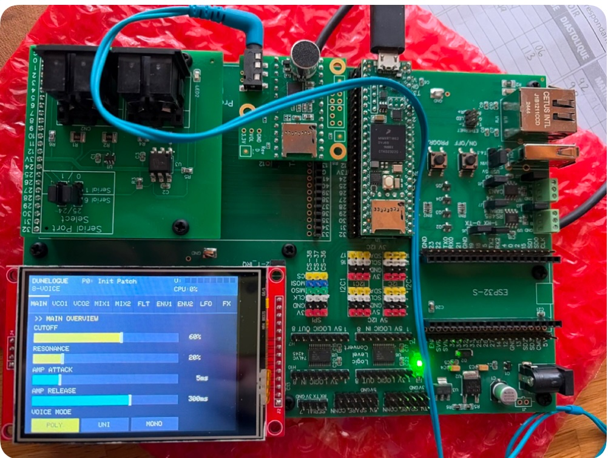

# Juno-106 Synthesizer Emulator for Teensy 4.1

A polyphonic software emulation of the classic Roland Juno-106 analog synthesizer,
running on a Teensy 4.1 with the PJRC Audio Adapter. Features a touchscreen UI,
patch storage on SD card, full MIDI (USB-device + USB-host + DIN), a custom
stereo BBD-style chorus, master soft-clip drive, an arpeggiator, and a rich
performance feature set.



---

## Features

### Sound engine
- **8-voice polyphony** (extendable to 16)
- **Juno-106-style voice architecture**
  - Sawtooth + pulse + sub-square oscillators, mixed continuously
  - Band-limited (anti-aliased) waveforms
  - Pulse-width control with LFO modulation
  - State-variable low-pass filter with resonance
  - Global high-pass filter
  - Separate amp + filter envelopes (ADSR)
- **LFO** with triangle / sine / square / saw shapes, routable to pitch, pulse-width, or filter cutoff
- **Polyphonic portamento / glide** (0–1000 ms)
- **Custom stereo Juno chorus** — two fractional-delay lines with opposite-phase sine LFOs, pre/post high-cut, feedback coloration
- **Master soft-clip drive** with compensating output gain

### Performance
- **Velocity routing**: VCA, cutoff, or LFO depth, with per-patch amount
- **Pitch bend** (±2 semitones)
- **Mod wheel** (additive to patch LFO depth)
- **Sustain pedal** (CC 64)
- **MIDI channel per patch** (OMNI or 1–16)
- **Arpeggiator** — UP / DOWN / UP-DOWN / RANDOM, 1–4 octaves, adjustable rate

### MIDI
- **USB-device** (Teensy plugged into a computer)
- **USB-host** (USB MIDI keyboard plugged into the Teensy's host port)
- **DIN MIDI** on Serial6
- All three sources active simultaneously
- Broad CC map covering oscillator mix, filter, envelopes, LFO, chorus, glide, and more

### UI
- Touchscreen with **6 tabbed pages**: PATCH / OSC / VCF / ENV / CHORUS / PERF
- **Header status bar** with:
  - CPU % load
  - Per-voice activity dots (green = held, yellow = releasing, grey = idle) — auto-scales for 6/8/16 voices
  - Stereo peak meter with peak-hold indicators
  - Tri-source MIDI activity indicators (USB / DIN / Host)
  - On-demand CAL (touch calibration) button
- **32 patch slots** with save / load / rename / init, highlighted selection + loaded indicator
- **On-screen keyboard** for naming patches
- **Touch calibration wizard** — self-calibrating via 3-corner taps, SD-persisted
- **22 factory patches** installed on first boot

### Engineering
- Three-context threading model: audio ISR, 1 kHz control ISR, main loop
- ISR-safe producer/consumer pattern for LFO and modulation
- Parameter smoothing at control rate (no zipper noise)
- Modular code structure with clean separation of concerns

---

## Quick Start

1. Build the hardware — see [`docs/HARDWARE.md`](docs/HARDWARE.md).
2. Install PlatformIO and clone this repo.
3. Open in VS Code with the PlatformIO extension.
4. Build & upload:
   ```bash
   pio run -t upload
   ```
5. On first boot the system will run touch calibration, then install 22 factory patches.
6. After first successful boot, set `INSTALL_FACTORY_ON_BOOT 0` in `Config.h` and reflash to protect your edits.
7. Plug in a MIDI keyboard (USB device, USB host, or DIN) and play.

Full build instructions in [`docs/BUILD.md`](docs/BUILD.md).

---

## Documentation index

| Document | Topic |
|----------|-------|
| [Hardware](docs/HARDWARE.md) | Wiring, pinout, BOM, USB-host notes |
| [Build & Setup](docs/BUILD.md) | PlatformIO config, first boot |
| [Architecture](docs/ARCHITECTURE.md) | Software structure and threading model |
| [Synthesis Engine](docs/SYNTHESIS.md) | Voice, chorus, LFO, drive, smoothing |
| [User Interface](docs/UI.md) | Touch UI layout, header status, pages |
| [MIDI](docs/MIDI.md) | All three MIDI sources, CC map, channel filter |
| [Patches](docs/PATCHES.md) | Patch storage format, factory presets |
| [Touch Calibration](docs/CALIBRATION.md) | Wizard, persistence, adjustment |
| [Tuning Guide](docs/TUNING.md) | Tweaking sound and feel |
| [Troubleshooting](docs/TROUBLESHOOTING.md) | Common issues and fixes |
| [Roadmap](docs/ROADMAP.md) | Planned features |

---

## Project Status

| Area | Status |
|------|--------|
| Synth engine | 8-voice polyphonic with band-limited oscillators, master drive |
| UI | 6 tabbed pages with rich header status |
| MIDI | USB device + USB host + DIN, all simultaneous |
| Sustain pedal + channel filter | Complete |
| Chorus | Custom BBD-style stereo effect with feedback coloration |
| Patch storage | SD-backed, 32 slots, 22 factory patches |
| Arpeggiator | 5 modes, octave range, adjustable rate |
| Touch calibration | On-screen wizard |
| Hardware encoders | Planned |
| MIDI clock sync | Planned |
| MIDI Learn | Planned |
| Step sequencer | Planned |

---

## Credits

- Built on [PJRC's Teensy Audio Library](https://www.pjrc.com/teensy/td_libs_Audio.html)
- USB Host MIDI via [USBHost_t36](https://github.com/PaulStoffregen/USBHost_t36)
- ILI9341 driver: [PaulStoffregen/ILI9341_t3](https://github.com/PaulStoffregen/ILI9341_t3)
- XPT2046 driver: [PaulStoffregen/XPT2046_Touchscreen](https://github.com/PaulStoffregen/XPT2046_Touchscreen)
- MIDI: [FortySevenEffects Arduino MIDI Library](https://github.com/FortySevenEffects/arduino_midi_library)
- Original Juno-106 design © Roland Corporation (this project is a clean-room software emulation, not affiliated)

---

## License

MIT License — see [`LICENSE`](LICENSE).
